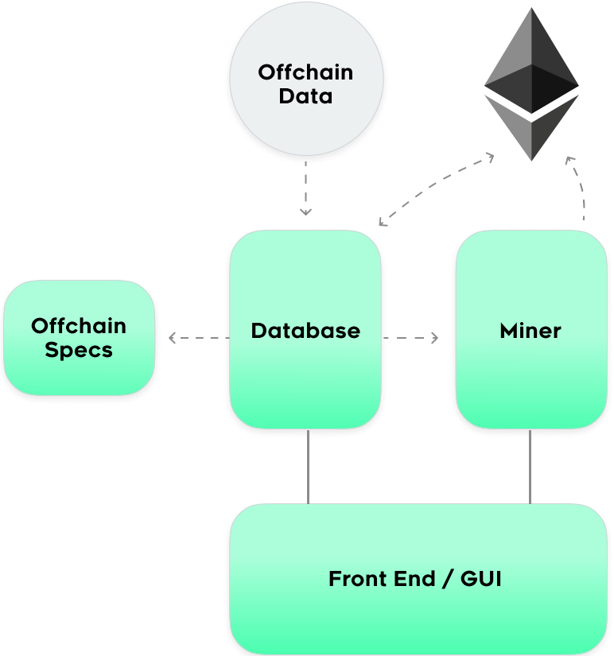

  

   

# Tellor Miner

This is the workhorse of the Miner system as it takes on solving the PoW challenge.  
It's built on Go and utilizes a split structure.  The database piece is a LevelDB that keeps track of all variables (challenges, difficulty, values to submit, etc.) and the miner simply solves the PoW challenge.  This enables parties to split the pieces for optimization.

    

### Tellor Deployed Addresses

Mainnet - [0x0ba45a8b5d5575935b8158a88c631e9f9c95a2e5](https://etherscan.io/address/0x0ba45a8b5d5575935b8158a88c631e9f9c95a2e5)

Rinkeby - [0xFe41Cb708CD98C5B20423433309E55b53F79134a](https://rinkeby.etherscan.io/address/0xFe41Cb708CD98C5B20423433309E55b53F79134a)

 

### Instructions for deployment

[Tellor Deployment Instructions](https://tellor.readthedocs.io/en/latest/MinerSetupTechnical/)

[Tellor Deployment Instructions -- For the Non-Technical Miner](https://tellor.readthedocs.io/en/latest/MinerSetupNonTechnical/)

[Tellor Deployment Instructions -- From Source](https://tellor.readthedocs.io/en/latest/MinerSetupFromSource/)

#### How to Contribute  
Join our Discord or Telegram:

### DISCLAIMER

    Mine at your own risk.  

    Mining requires you deposit 1000 Tellor Tributes.  These are a security deposity.  If you are a malicious actor (aka submit a bad value), the community can vote to slash your 1000 tokens.  

    Mining also requires submitting on-chain transactions on Ethereum.  These transactions cost gas (ETH) and can sometimes be signifiant if the cost of gas on EThereum is high (i.e. the network is clogged).  Please reach out to the community to find the best tips for keeping gas costs under control or at least being aware of the costs. 

    If you are building a competing client, please contact us.  A lot of the miner specifications are off-chain and a significant portion of the mining process hinges on the consensus of the Tellor community to determine what proper values are.  Competing clients that change different pieces run the risk of being disputed by the commmunity.  

    There is no guaruntee of profit from mining. 

    There is no promise that Tellor Tributes currently hold or will ever hold any value. 

Please join our Discord for more information and community updates. 

#### Contributors

This repository is maintained by the Tellor team - [www.tellor.io](https://www.tellor.io)

#### Copyright

Tellor Inc. 2019
